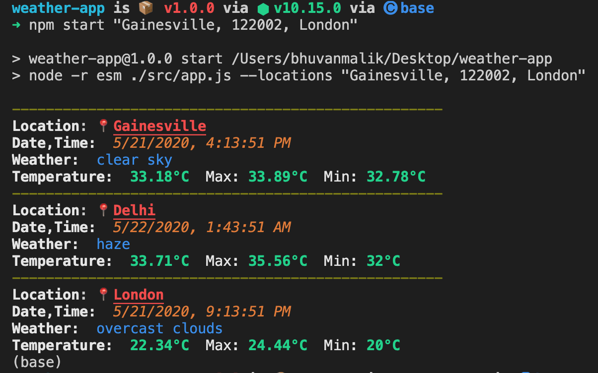

# *Weather-App* 🌤

 - Powered by OpenWeather API.
 - Chalk.js used for styling.
 - Prettier + ESLint + Airbnb Style Guide for code formatting and maintainable code style.
 - ECMAScript Modules for separating different concerns of the application.

## List of commands

 - **Clone the repo.**
 -  **Change directory to the cloned repo.**
 -  **`npm install`**
 -  **`npm start "New York, London, 122002"`**
**Note:** Only accepts a comma separated list of cities/postal codes. The input has to be a String in " ".

  

